# kora

`kora` 是一个轻量级、偏 MyBatis 风格的 SQL 框架，核心目标是把：

- XML SQL 的可读性
- Wrapper DSL 的类型安全
- 编译期代码生成
- 无运行时反射

组合到一起。

当前仓库包含核心运行时、注解处理器、Spring Boot / Quarkus 集成，以及一个可直接运行的 `simple` 示例模块。

## 模块

- `kora-core`
  注解、运行时接口、JDBC 执行、Wrapper DSL、分页、Reflector、Dialect SPI。
- `kora-processor`
  编译期扫描、Mapper 实现生成、实体表元数据生成、Reflector 生成。
- `kora-quarkus`
  Quarkus 扩展运行时、`SqlExecutor` 默认生产者、Mapper Bean 自动注册、静态 `Sql` 入口绑定。
- `kora-spring-boot`
  Spring Boot 自动配置、事务感知 `SqlSession`、Mapper Bean 自动注册、静态 `Sql` 入口。
- `simple`
  仓库内示例，覆盖 XML Mapper、Wrapper、分页、Reflector、批量 CRUD、Spring 风格扫描配置。

## 当前能力

- `@KoraScan` 扫描实体包、Mapper 包，XML 通过 `-Akora.mapper=...` 指定
- `@Reflect` 生成 `XxxReflector`
- XML `select / insert / update / delete`
- XML 动态标签 `where / if / foreach`
- `#{id}`、`#{query.minAge}`、`#{filter.range.minAge}` 参数绑定
- 自动生成 `XxxMapperImpl`
- 自动生成 `XxxTable`
- `BaseMapper` 通用 CRUD、批量操作、Wrapper 查询与更新
- `@MapperCapability` 共享能力委托
- `Page<T>` 分页
- `Map<String, Object>`、基础类型、实体映射
- Spring Boot 自动注册 `SqlSessionFactory`、`SqlSession`、Mapper Bean
- Quarkus 自动注册 `SqlExecutor`、Mapper Bean
- 静态 `Sql.query()` / `Sql.from(...)` / `Sql.select(...)` 查询入口
- SQL Dialect SPI

## 环境

- JDK 21
- Gradle Wrapper

## 快速开始

### 1. 依赖

```kotlin
dependencies {
    implementation("com.nicleo:kora-core:1.0.0")
    annotationProcessor("com.nicleo:kora-processor:1.0.0")
}
```

在当前多模块仓库内也可以直接依赖项目模块：

```kotlin
dependencies {
    implementation(project(":kora-core"))
    annotationProcessor(project(":kora-processor"))
}

tasks.withType<JavaCompile>().configureEach {
    options.compilerArgs.add("-Akora.mapper=${project.projectDir}/src/main/resources/mapper")
}
```

### 2. 扫描入口

```java
package com.example.simple.config;

import com.nicleo.kora.core.annotation.KoraScan;

@KoraScan(
        entity = {"com.example.simple.entity"},
        mapper = {"com.example.simple.mapper"}
)
public class KoraSimpleConfig {
}
```

### 3. 实体与 Reflector

```java
package com.example.simple.entity;

import com.nicleo.kora.core.annotation.Reflect;

@Reflect
public class User {
    private Long id;
    private String name;
    private Integer age;

    public User() {
    }

    public Long getId() {
        return id;
    }

    public void setId(Long id) {
        this.id = id;
    }

    public String getName() {
        return name;
    }

    public void setName(String name) {
        this.name = name;
    }

    public Integer getAge() {
        return age;
    }

    public void setAge(Integer age) {
        this.age = age;
    }
}
```

编译后会生成：

- `UserMapperImpl`
- `UserTable`
- `UserReflector`

### 4. Reflect 分级

`@Reflect` 当前支持两档 metadata：

- `ReflectMetadataLevel.BASIC`
  生成字段访问与基础元数据
- `ReflectMetadataLevel.METHOD`
  额外生成方法相关元数据与方法调用分发

例如：

```java
@Reflect(metadata = ReflectMetadataLevel.METHOD, annotationMetadata = true)
public class User {
}
```

运行期访问：

```java
GeneratedReflector<User> reflector = GeneratedReflectors.get(User.class);
User user = reflector.newInstance();
reflector.set(user, "name", "Alice");
Object value = reflector.get(user, "name");
```

### 5. Mapper 接口

```java
package com.example.simple.mapper;

import com.example.simple.entity.User;
import java.util.List;

public interface UserMapper {
    User selectById(Long id);

    List<User> selectByAgeRange(Integer minAge, Integer maxAge);
}
```

### 6. XML Mapper

`namespace` 必须对应 Mapper 接口全限定名：

```xml
<mapper namespace="com.example.simple.mapper.UserMapper">
    <select id="selectById">
        select id, name, age
        from users
        where id = #{id}
    </select>

    <select id="selectByAgeRange">
        select id, name, age
        from users
        <where>
            <if test="minAge != null">
                age <![CDATA[ >= ]]> #{minAge}
            </if>
            <if test="maxAge != null">
                and age <![CDATA[ <= ]]> #{maxAge}
            </if>
        </where>
        order by id
    </select>
</mapper>
```

## 运行时使用

### 直接使用 `SqlSession`

```java
JdbcDataSource dataSource = new JdbcDataSource();
dataSource.setURL("jdbc:h2:mem:test;MODE=MySQL;DB_CLOSE_DELAY=-1");
dataSource.setUser("sa");
dataSource.setPassword("");

SqlSession sqlSession = new DefaultSqlSession(dataSource);
UserMapper userMapper = new UserMapperImpl(sqlSession);

User user = userMapper.selectById(1L);
```

## Wrapper DSL

除了 XML，也可以直接使用 Wrapper DSL 构造查询。

### 条件查询

```java
List<User> users = userMapper.selectList(
        Wrapper.where()
                .where(
                        UserTable.TABLE.age.ge(18),
                        UserTable.TABLE.name.isNotNull()
                )
                .orderBy(order -> order.asc(UserTable.TABLE.id))
);
```

### 分页

```java
Paging paging = Paging.of(1, 10);
Page<User> page = userMapper.selectPage(paging, 18, 30);
```

### alias-aware DSL

```java
var total = Functions.count().as("total");
var ageGroup = Functions.ifElse(UserTable.TABLE.age.ge(18), "adult", "minor").as("age_group");

var query = Wrapper.query()
        .select(ageGroup, total)
        .from(UserTable.TABLE)
        .groupBy(ageGroup)
        .having(total.ge(2))
        .orderBy(order -> order.desc(total));
```

支持：

- `orderBy(order -> order.desc(total))`
- `orderBy(order -> order.descAlias("total"))`
- `groupBy(ageGroup)`
- `groupByAlias("age_group")`
- `having(total.ge(2))`
- `having(h -> h.geAlias("total", 2))`

### join 快捷写法

```java
var users = UserTable.TABLE;
var manager = UserTable.TABLE.alias("manager");

var query = Wrapper.query()
        .select(users.name, manager.name)
        .from(users)
        .leftJoin(manager, on -> on.eq(users.id, manager.id));
```

现在列对列比较可以直接写：

```java
users.id.eq(manager.id)
users.age.ge(manager.age)
```

## `BaseMapper` 通用能力

当前示例已经覆盖：

- `selectOne`
- `selectList`
- `count`
- `insert(T)`
- `insert(List<T>)`
- `updateById(T)`
- `updateById(List<T>)`
- `update(UpdateWrapper<T>)`
- `deleteById`
- `delete(WhereWrapper<T>)`
- `page(Paging, WhereWrapper<T>)`

## `@MapperCapability`

可以把公共 SQL 能力实现成共享组件，再让业务 Mapper 通过接口继承得到这些方法。

```java
public interface UpdateMapper<T> {
    int updateNameById(Long id, String name);
}

@MapperCapability(UpdateMapper.class)
public class UpdateMapperImpl<T> extends AbstractMapper<T> implements UpdateMapper<T> {
    public UpdateMapperImpl(SqlSession sqlSession, Class<?> entityClass) {
        super(sqlSession, entityClass);
    }

    @Override
    public int updateNameById(Long id, String name) {
        return sqlSession.update(
                "update users set name = ? where id = ?",
                new Object[]{name, id}
        );
    }
}
```

支持的能力构造器：

- `(SqlSession)`
- `(SqlSession, Class<?>)`
- `(SqlSession, EntityTable<?>)`

## SQL Dialect SPI

`kora` 现在已经提供方言 SPI，用于承载：

- 标识符引用规则
- 分页渲染
- query/update/delete/insert renderer
- count rewrite

核心接口：

- `SqlDialect`
- `SqlDialectRegistry`
- `IdentifierPolicy`
- `PagingRenderer`
- `QueryRenderer`
- `UpdateRenderer`
- `DeleteRenderer`
- `InsertRenderer`
- `CountQueryRewriter`

当前默认方言注册器：

- MySQL
- MariaDB
- PostgreSQL
- SQLite
- Oracle
- SQL Server
- H2

## Spring Boot 集成

### 依赖

```kotlin
dependencies {
    implementation("com.nicleo:kora-spring-boot:1.0.0")
    annotationProcessor("com.nicleo:kora-processor:1.0.0")
}
```

### 自动配置提供

存在 `DataSource` 时，`kora-spring-boot` 会自动提供：

- `SqlSessionFactory`
- 原型作用域 `SqlSession`
- `SqlPagingSupport`
- `SqlGenerator`
- Mapper Bean 注册器
- 静态 `Sql` 入口绑定

### 静态查询入口

```java
User user = Sql.query()
        .selectAll()
        .from(UserTable.TABLE)
        .orderBy(order -> order.asc(UserTable.TABLE.id))
        .limit(1)
        .one(User.class);
```

也支持更短的查询入口：

```java
User user = Sql.from(UserTable.TABLE)
        .where(UserTable.TABLE.id.eq(1L))
        .one(User.class);
```

```java
User user = Sql.select(UserTable.TABLE, UserTable.TABLE.id.eq(1L));
List<User> users = Sql.selectList(
        UserTable.TABLE,
        UserTable.TABLE.age.ge(18),
        UserTable.TABLE.name.isNotNull()
);
```

说明：

- `Sql.query()`
  从空查询开始，适合复杂 DSL 组合
- `Sql.from(table)`
  默认 `selectAll().from(table)`，适合从单表快速起查询
- `Sql.select(table, conditions...)`
  默认单条查询语义，内部会执行 `.one(table.entityType())`
- `Sql.selectList(table, conditions...)`
  默认多条查询语义，内部会执行 `.list(table.entityType())`

也支持直接静态 CRUD：

```java
Sql.insert(user);
Sql.updateById(user);
Sql.deleteById(User.class, 1L);
```

## Quarkus 集成

### 依赖

```kotlin
dependencies {
    implementation("com.nicleo:kora-quarkus:1.0.0")
    annotationProcessor("com.nicleo:kora-processor:1.0.0")
}
```

### 自动配置提供

存在 `DataSource` 时，`kora-quarkus` 会自动提供：

- `SqlExecutor`
- `SqlPagingSupport`
- `SqlGenerator`
- Mapper Bean 自动注册
- 静态 `Sql` 入口绑定
- `@KoraScan` 生成表/Reflector 的启动期安装

### 用法

和 Spring Boot 一样，Quarkus 下仍然通过 `@KoraScan` 描述实体与 Mapper 包：

```java
@KoraScan(
        entity = {"com.example.quarkus.entity"},
        mapper = {"com.example.quarkus.mapper"}
)
public class KoraQuarkusConfig {
}
```

生成的 Mapper 可以直接通过 CDI 注入：

```java
@Inject
UserMapper userMapper;
```

静态 DSL 入口同样可用：

```java
User user = Sql.from(Tables.get(User.class))
        .limit(1)
        .one(User.class);
```

## 构建与测试

运行全部测试：

```bash
./gradlew test
```

发布到本地 Maven：

```bash
./gradlew publishToMavenLocal
```

发布到 Repsy：

```bash
./gradlew publishAllPublicationsToRepsyRepository \
  -PrepsyUsername=${providers.environmentVariable("REPSY_USERNAME")} \
  -PrepsyPassword=your-password
```

也可以使用环境变量：

- `REPSY_USERNAME`
- `REPSY_PASSWORD`

仓库地址：

- `https://repo.repsy.io/${providers.environmentVariable("REPSY_USERNAME")}/public`

## 性能测试

`simple` 模块内置了基于 `JMH` 的性能测试，当前覆盖这些场景：

- 单条查询 `selectById`
- 范围查询 `selectByAgeRange`
- 单条写入 `insertOne`
- 单条更新 `updateById`
- 单条删除 `deleteById`
- 分页查询 `page`
- 批量写入 `batchInsert(100 rows/batch)`

性能测试代码：

- `simple/src/test/java/com/example/simple/benchmark/SimpleMapperPerformanceBenchmark.java`

运行方式：

```bash
./gradlew :simple:jmh
```

只看 `Kora` / `MyBatis-Plus` / `jOOQ` / `Jimmer` 对比：

```bash
./gradlew :simple:jmh --args "SimpleMapperPerformanceBenchmark.(kora|myBatisPlus|jooq|jimmer).* -wi 1 -i 3 -w 1s -r 1s -f 1"
```

说明：

- 默认基准模式为 `Throughput`
- 输出单位为 `ops/s`
- 数据库使用内存 `H2`
- 当前主对比维度是 `Kora`、`MyBatis-Plus`、`jOOQ`、`Jimmer`
- `MyBatis` 查询基线代码仍保留在基准类中，便于后续单独补跑
- `updateById` 与 `deleteById` 场景会在基准过程中保证命中存在数据，避免退化为大量空操作

### 本地测试数据

测试环境：

- JDK `21`
- GraalVM CE `21.0.2`
- `1` 线程
- `1` 次预热 / `3` 次测量 / 每次 `1s`

#### 四框架结果

| 场景 | Kora (ops/s) | MyBatis-Plus (ops/s) | jOOQ (ops/s) | Jimmer (ops/s) |
|---|---:|---:|---:|---:|
| `selectById` | 120,852.775 | 59,485.562 | 86,938.233 | 80,443.975 |
| `selectByAgeRange` | 9,279.977 | 954.470 | 8,619.618 | 12,916.445 |
| `insertOne` | 150,727.385 | 45,405.326 | 91,497.395 | 58,856.993 |
| `updateById` | 129,969.666 | 26,389.191 | 83,238.886 | 50,276.253 |
| `deleteById` | 127,589.454 | 27,823.167 | 73,485.918 | 90,250.492 |
| `page` | 5,774.166 | 4,526.751 | 4,906.532 | 5,329.895 |
| `batchInsert` | 3,806.895 | 1,240.002 | 1,819.410 | 1,389.759 |

批量写入按 `100 rows/batch` 折算吞吐：

- `Kora`: `380,690 rows/s`
- `MyBatis-Plus`: `124,000 rows/s`
- `jOOQ`: `181,941 rows/s`
- `Jimmer`: `138,976 rows/s`

当前这组本地结果下：

- `Kora` 在 `selectById`、`insertOne`、`updateById`、`deleteById`、`page`、`batchInsert` 上最高
- `Jimmer` 在 `selectByAgeRange` 上最高

#### 图表

```mermaid
%%{init: {"theme":"base","themeVariables":{"background":"#0f172a","primaryColor":"#2563eb","secondaryColor":"#f97316","tertiaryColor":"#22c55e","primaryTextColor":"#e5e7eb","secondaryTextColor":"#e5e7eb","tertiaryTextColor":"#e5e7eb","lineColor":"#94a3b8","textColor":"#e5e7eb","mainBkg":"#0f172a","fontFamily":"ui-sans-serif"}}}%%
xychart-beta
    title "CRUD Throughput (ops/s)"
    x-axis ["selectById", "insertOne", "updateById", "deleteById"]
    y-axis "ops/s" 0 --> 160000
    bar [120853, 150727, 129970, 127589]
    bar [59486, 45405, 26389, 27823]
    bar [86938, 91497, 83239, 73486]
    bar [80444, 58857, 50276, 90250]
```

```mermaid
%%{init: {"theme":"base","themeVariables":{"background":"#0f172a","primaryColor":"#2563eb","secondaryColor":"#f97316","tertiaryColor":"#22c55e","primaryTextColor":"#e5e7eb","secondaryTextColor":"#e5e7eb","tertiaryTextColor":"#e5e7eb","lineColor":"#94a3b8","textColor":"#e5e7eb","mainBkg":"#0f172a","fontFamily":"ui-sans-serif"}}}%%
xychart-beta
    title "Range / Page / Batch Throughput (ops/s)"
    x-axis ["selectByAgeRange", "page", "batchInsert"]
    y-axis "ops/s" 0 --> 14000
    bar [9280, 5774, 3807]
    bar [954, 4527, 1240]
    bar [8620, 4907, 1819]
    bar [12916, 5330, 1390]
```





图例：

- 第一组柱状为 `Kora`
- 第二组柱状为 `MyBatis-Plus`
- 第三组柱状为 `jOOQ`
- 第四组柱状为 `Jimmer`

## 项目结构

```text
.
|-- kora-core
|-- kora-processor
|-- kora-quarkus
|-- kora-quarkus-deployment
|-- kora-spring-boot
`-- simple
```

## 参考文件

- `simple/src/main/java/com/example/simple/config/KoraSimpleConfig.java`
- `simple/src/main/java/com/example/simple/mapper/UserMapper.java`
- `simple/src/main/resources/mapper/UserMapper.xml`
- `simple/src/test/java/com/example/simple/SimpleIntegrationTest.java`
- `simple/src/test/java/com/example/simple/benchmark/SimpleMapperPerformanceBenchmark.java`
- `kora-quarkus-deployment/src/test/java/com/nicleo/kora/quarkus/deployment/test/KoraQuarkusProcessorTest.java`
- `kora-spring-boot/src/test/java/com/nicleo/kora/spring/boot/autoconfigure/KoraAutoConfigurationTest.java`
